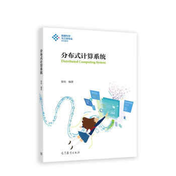

作者：[徐辰](https://faculty.ecnu.edu.cn/_s37/xc/main.psp)

## 内容简介

本书聚焦于 Hadoop、Spark、Flink 等面向数据密集型应用的分布式计算系统，将原理、架构、编程的知识进行有机结合，统一从设计思想、体系架构、工作原理、容错机制和编程示例 5 个维度进行剖析。本书注重通过横向比较阐释该类系统设计的共性原理，帮助读者形成完整、统一的知识体系。

本书概述了分布式计算系统（第 1 章），根据应用场景的差异将分布式计算系统划分为批处理系统（第 3、4 章）、流计算系统（第 7、8 章）、批流融合系统（第 9、10 章）、图处理系统（第 11 章），并选取了各个类别中的典型代表。由于这些分布式计算系统不可能孤立地存在，因此本书也介绍了面向文件存储（第 2 章）、资源管理（第 5 章）以及协调服务（第 6 章）的系统。

本书可作为高等院校数据科学与大数据技术专业高年级本科生的教学用书，以及计算机科学与技术、软件工程、数据科学与工程等专业研究生的教学用书，也可作为部分业界研发人员的参考用书。



## 纸质书获取

本书由高等教育出版社出版，欢迎通过[京东](https://item.jd.com/13403413.html)、[当当](http://product.dangdang.com/29465457.html)、[微店](https://weidian.com/item.html?itemID=5563501645)、[天猫](https://detail.tmall.com/item.htm?id=684769298015&skuId=4890169920226)等平台选购。

## 引用信息

```
徐辰, 分布式计算系统, 高等教育出版社, https://dasebigdata.github.io/, 2022.
```

```
@book{xu2022dasebigdata,
title = {分布式计算系统},
publisher = {高等教育出版社},
year = {2022},
author = {徐辰},
address = {上海},
isbn = {9787040584509},
url = {https://dasebigdata.github.io/},
}
```

## 致谢

本书的编写得到了 2020 年度华东师范大学精品教材建设专项基金的资助。在编写过程中，华东师范大学数据科学与工程学院数据管理与智能计算系统研究组的研究生在图表绘制、代码整理等方面做了大量的协助工作。其中，毕倪飞参与编写了第 4、8、9 章，陈梓浩参与编写了第 1、6 章，陈启航参与编写了第 7 章，丁光耀参与编写了第 5、10 章，杨溢参与编写了第 2、3、11 章。此外，杨溢、孟令睿参与了书稿的校对工作。借此机会，向以上同学的辛勤付出致以衷心的感谢！

