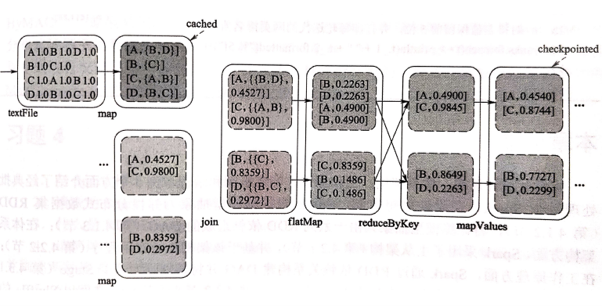

| 页码 | 位置                                       | 原文                                                         | 更正                                                         |
| ---- | ------------------------------------------ | ------------------------------------------------------------ | ------------------------------------------------------------ |
| 48   | 图 3.16 关系表自然连接的运行过程            |  |  |
| 99   | 图 4.22  K 均值聚类的首次迭代过程          |  |  |
| 103  | 图 4.23  网页链接排名中第 5 轮迭代计算过程 |  |  |
| 107  | 图 5.1  Yarn 架构图                        |  |  |
| 123  | 第 12 行                                   | 因此 cluster 会发生变化，并主动通知 TaskTracker              | 因此 cluster 会发生变化，并主动通知 JobTracker |
| 296  | 引用 [68]                                  | MaMng a Yellow Elephant Run Like a Cheetah                   | Making a Yellow Elephant Run Like a Cheetah |

致谢：感谢韩正愿、宋立康、彭寿江等同学指出本书中的错误。

